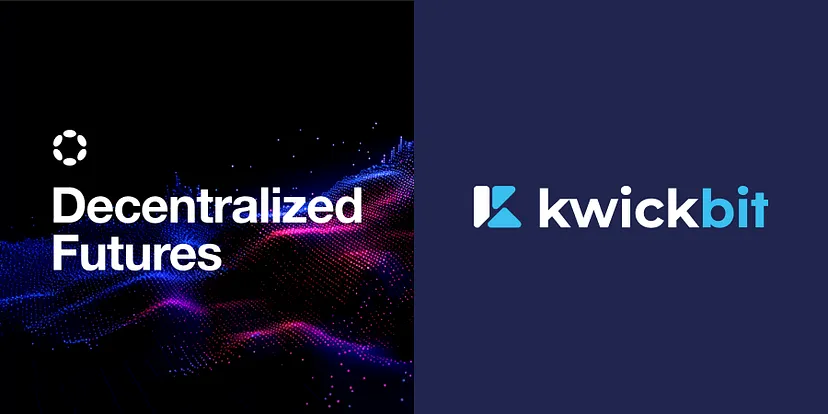

# Polkadot Ecosystem Smart Contract Solutions Benchmark

## Overview

This repository benchmarks various smart contract solutions in the Polkadot ecosystem for implementing a **non-custodial payment gateway**.
The goal is to evaluate how different platforms can support a non-custodial payment system, where merchants can
accept stablecoin payments from users securely without needing to have a custodial intermediary holding their funds.

### Example Use Case
A merchant integrates KwickBit's payment gateway to accept USDC payments. A customer pays in USDC, which is routed to the merchant through the system.

The benchmark compares technical capabilities, user flows, and trade-offs across different Polkadot parachains to achieve this result efficiently and reliably.

Our chosen platforms for this benchmark are:

- **Moonbeam**: Representing the EVM compatibility layer.
- **Pop Network**: Representing the Wasm compatibility layer.

## Smart Contract Platforms Benchmarked

### 1. **Moonbeam**

Moonbeam is a smart contract platform within the Polkadot ecosystem that provides full Ethereum compatibility. It is a parachain that enables developers to deploy existing Ethereum-based smart contracts with minimal changes.

**Key Features of Moonbeam:**

- **Full Ethereum Compatibility**: Moonbeam supports Solidity smart contracts, allowing Ethereum projects to be ported easily.
- **Integration with Polkadot**: As a Polkadot parachain, Moonbeam benefits from Polkadot's shared security and cross-chain interoperability.
- **Ethereum Tools**: Developers can use popular Ethereum tools like Remix, Truffle, and Hardhat.
- **Native Token Support**: Moonbeam supports XC-20 tokens, which are interoperable across the Polkadot ecosystem.
- **EVM-Compatible**: It provides a full EVM implementation, enabling the use of Ethereum-based decentralized applications (dApps).

For detailed information about the Moonbeam implementation, benchmarks, and usage, refer to the [Moonbeam folder](moonbeam/README.md).

### 2. **Pop Network**

Pop Network is a Wasm-focused smart contract platform within the Polkadot ecosystem. It leverages advanced Wasm capabilities and cross-chain communication through **XCM**.

**Key Features of Pop Network:**

- **Active Community**: Pop Network boasts a highly active developer community, ensuring constant improvements and support.
- **Advanced Tutorials**: Offers resources for advanced use cases, such as cross-chain smart contract communication through XCM, aligning perfectly with the goals of this benchmark.
- **Developer Tools**: Provides robust and user-friendly web development tools tailored for Wasm environments.
- **Cross-Chain Focus**: Strong emphasis on enabling seamless cross-chain communication.

For more information on the Pop Network implementation and its benchmarks, refer to the [Pop Network folder](pop-network/README.md).

## Purpose of the Benchmark

The goal of this repository is to evaluate and compare the performance of different smart contract platforms in the Polkadot ecosystem. Specific areas of focus include:

- **Execution speed**
- **Scalability**
- **Developer experience**
- **User experience for seamless invoice payments on-chain**

By highlighting the differences between Wasm and EVM compatibility, this benchmark provides valuable insights for developers choosing a platform for their projects.

## User Flow

### Using Moonbeam
1. **Teleport USDC to Moonbeam**:
    - The user first teleports USDC from Asset Hub to Moonbeam, converting it into xUSDC.
    - This step is necessary as the smart contract operates on Moonbeam and requires xUSDC.
2. **Call the Smart Contract**:
    - The user interacts with the smart contract deployed on Moonbeam.
    - The call requires the user to have some Moonbeam tokens (e.g., GLMR) to cover the gas fees.
3. **Result**:
    - If the contract call succeeds, the payment is processed.
    - If the contract call fails, the user is left with xUSDC on Moonbeam, requiring a separate teleport to convert it back to Asset Hub USDC.

**Drawbacks of Moonbeam Approach:**
- **Non-Atomic Workflow**: Teleporting USDC and calling the smart contract cannot be done in a single batch. If the contract call fails, the user ends up with xUSDC without explicitly requesting it.
- **Requires Moonbeam Tokens**: The user must have Moonbeam tokens (GLMR) to pay for gas fees, adding an extra step for onboarding.

### Using Pop Network
1. **Transfer PAS to Pop Network**:
    - The user teleports PAS tokens from the relay chain to the Pop network.
    - These tokens are required to pay gas fees for interacting with the smart contract on Pop.
2. **Call the Smart Contract**:
    - The user calls the `pay` method on the smart contract, providing the required parameters (e.g., amount and payment ID).
3. **Off-Chain Indexer Processing**:
    - The off-chain indexer listens for the event emitted by the Pop network and triggers either a `callback_success` or `callback_fail` method.
4. **Finalization**:
    - The result of the payment is finalized through the callback method. This process involves an additional on-chain call, which incurs gas fees.

**Drawbacks of Pop Network Approach:**
- **Requires PAS Tokens**: The user must acquire and transfer PAS tokens to the Pop network for gas fees.
- **Longer Process**: The payment process involves an additional off-chain step and a subsequent on-chain callback, leading to longer overall transaction times.
- **Self-Paid Gas Fees for Callbacks**: The platform (not the user) pays the gas fees for the callback methods, increasing operational costs.

## Benchmarks

### Moonbeam

- Transferring from Relay Chain To Moonbase: TBD
- Transferring from Moonbase to Relay Chain: TBD
- Approving XC-20 Transfer: ~25s
- Submitting Payment: ~25s
- Indexer: ~1-3s

### Pop Network

- Cross-chain Transfer with XCM: TBD
- Submitting Payment: TBD
- Indexer: TBD
- Callback Success Execution: TBD

## Why These Platforms?

### Moonbeam
We chose Moonbeam for the EVM part for several reasons:

- One of the most mature and well-established parachains within the Polkadot ecosystem.
- Support for stablecoins, especially **USDC**, which is critical for financial use cases.
- Easy smart contract development with Ethereum-compatible tools and frameworks.

### Pop Network
We chose Pop Network for the Wasm part for several reasons:

- **Active Developer Community**: A highly engaged community ensures continuous improvements and support.
- **Tutorials for Advanced Use Cases**: Pop Network provides comprehensive guides for implementing advanced features like cross-chain smart contract communication via XCM.
- **Developer-Friendly Tools**: Offers intuitive and robust web tools for Wasm smart contract development.
- **Cross-Chain Communication**: Seamless support for XCM makes it ideal for applications requiring inter-parachain interactions.

## Benchmarks

### Moonbeam 

- Transferring from Relay Chain To Moonbase: TBD

- Transferring from Moonbase to Relay Chain: TBD

- Approving XC-20 Transfer: ~25s

- Submitting Payment: ~25s

- Indexer: ~1-3s

### Pop

- Transferring from Relay Chain To Pop: TBD

- Transferring from Pop to Relay Chain: TBD

- Approving Transfer: TBD

- Submitting Payment: TBD

- Indexer: TBD

## Contributing

If you would like to contribute to this project or add additional benchmarks, feel free to open a pull request. Make sure to follow the repository's contribution guidelines.

## License

This project is licensed under the MIT License. See the [LICENSE](LICENSE) file for more details.
